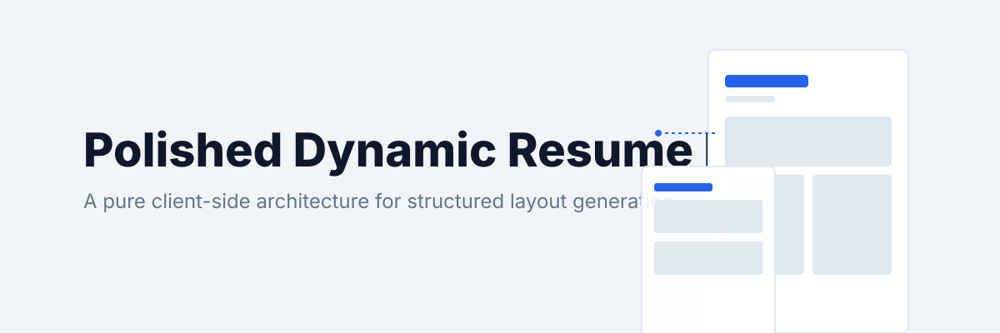
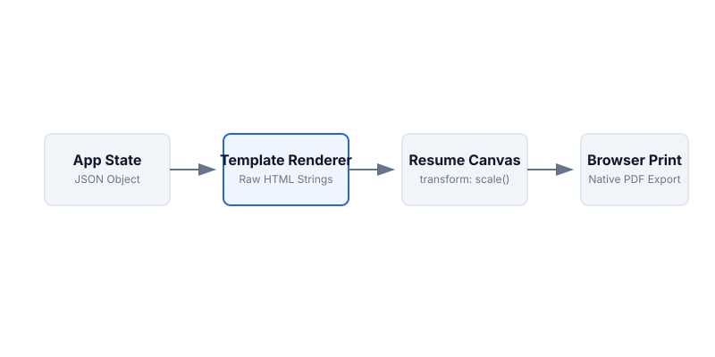
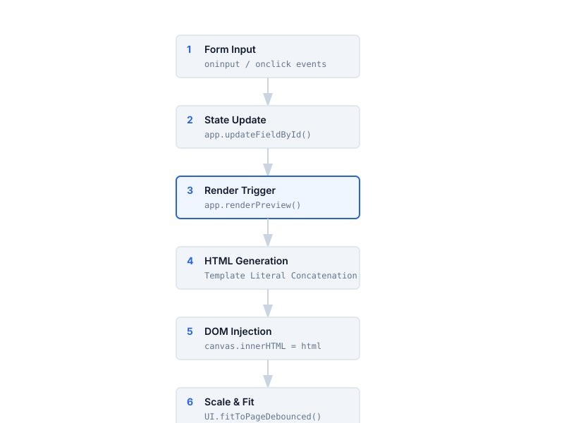

<div align="center">



<br>

# ✨ Polished Dynamic Resume Builder

**A zero-dependency, fully responsive, client-side resume builder with 18 templates, real-time preview, GitHub integration, and native PDF export.**


<br>

**[Live Demo](#quick-start)** · **[Features](#features)** · **[Templates](#-templates)** · **[Usage](#usage)**

</div>

---

## Overview

A browser-based resume builder that runs entirely inside a single `index.html` file. No frameworks, no build steps, no backend, no dependencies — just open it in a browser and start building.

Your data is stored as a structured JSON state object. Every keystroke triggers a real-time re-render of the selected template directly into a pixel-perfect A4 preview canvas. Export to PDF using the browser's native print engine.

## Features

### 🖊️ Step-by-Step Wizard
A 6-step guided flow walks you through building your resume:

| Step | What you fill in |
|------|-----------------|
| **1. Info** | Name, email, phone, location, website/LinkedIn, professional summary |
| **2. Experience** | Job titles, companies, dates, bullet-point descriptions |
| **3. Education** | Institutions, degrees, streams, graduation years |
| **4. Skills** | Technical skills & languages with proficiency levels (Beginner → Expert) |
| **5. Projects** | GitHub repos (auto-fetched) + custom manual projects of any kind |
| **6. Design** | Template, typography, accent color selection + live preview + PDF export |

### 🔗 GitHub Integration
Enter any GitHub username and click **Fetch** to pull public repositories. Select which repos to include on your resume — the repo name, primary language, and description are automatically populated.

### 🛠️ Custom Projects
For projects that aren't on GitHub (civil engineering, research, mechanical, theoretical, etc.), add them manually with:
- Project name & date
- Project link / tech stack
- Full description

### 🎨 18 Resume Templates

| Template | Style |
|----------|-------|
| **Classic** | Centered header, clean traditional layout |
| **Modern** | Flexbox sidebar with colored left column |
| **Minimalist** | Left-aligned, two-column with minimalist typography |
| **Professional** | Thick top border with shaded section headers |
| **Creative** | High-contrast colored sidebar with bold layout |
| **Executive** | Centered, uppercase heavy, commanding presence |
| **Tech** | Monospace fonts, dark accents, terminal-inspired headers |
| **Claude** | Elegant serif with italicized section headers |
| **Swiss** | Lowercase, heavy weights, right-aligned two-column grid |
| **Infographic** | Sidebar with timeline icons and skill progress bars |
| **Dashboard** | Card-based CSS multi-column grid layout |
| **Min-Info** | Oversized text with dot-tracker skill proficiencies |
| **Max-Info** | Dark mode, high contrast, blocky with heavy borders |
| **Art-Info** | Organic blob shapes with clean timeline layout |
| **Art-Info 0** | Brutalist aesthetic with thick solid borders |
| **Art-Info 4** | Glassmorphism with blurred circles and translucent panels |
| **Comic** | Comic book panels, rotated elements, drop shadows |
| **Art Info 2** | Data-viz layout with CSS-rendered pie and bar charts |

### 🔤 8 Typography Pairs

| Name | Header Font | Body Font |
|------|------------|-----------|
| Elegant | Merriweather | Source Sans 3 |
| Modern | Montserrat | Lato |
| Technical | Roboto Slab | Roboto |
| Classic | Playfair Display | Open Sans |
| Chic | Cormorant Garamond | Proza Libre |
| Bold | Oswald | Inter |
| Claude | Fraunces | Inter |
| Swiss | Helvetica Neue | Helvetica Neue |

### 🎨 8 Accent Colors
Slate · Navy · Emerald · Burgundy · Purple · Teal · Rust · Black

### 🌙 Dark Mode
Full dark/light theme toggle for the editor UI. The resume preview always renders with its own template-specific colors regardless of editor theme.

### 💾 Local Storage
Click **Save** to persist your entire resume state to `localStorage`. Click **Load** to restore it. Your data never leaves your browser.

### 📱 Fully Responsive (Mobile-First)

The app is fully optimized for smartphones:

- **On mobile (< 768px):** The live preview is hidden. You fill out your resume step-by-step in a full-screen wizard. On the final Design step, a **Preview** button slides the resume into view as a full-screen overlay, perfectly scaled to fit your phone screen. A floating **✕** button returns you to the editor.
- **On desktop:** The classic side-by-side layout with real-time preview is preserved exactly as-is.

### 📄 PDF Export

Click **Export** to generate a pixel-perfect A4 PDF using the browser's native `window.print()` functionality. The app uses a custom `UI.fitToPage()` algorithm that:

1. Measures your resume content height
2. Binary-searches for the optimal `transform: scale()` value
3. Inflates the canvas width inversely so the final output is always exactly 210mm × 297mm
4. On mobile, temporarily resets all viewport scaling before triggering print

No external PDF libraries. No server calls. What you see is exactly what you get.

## Architecture

<div align="center">
  
</div>

The application is built without virtual DOMs or external frameworks. Vanilla JavaScript binds form inputs to a central `app.state` object, which triggers a complete re-render of the selected template upon any modification.

## Data Flow

<div align="center">
  
</div>

```
User Input → app.state (JSON) → renderPreview() → Template HTML → A4 Canvas → PDF
```

## Project Structure

```
project/
├── index.html          # The entire application (HTML + CSS + JS)
├── assets/
│   ├── architecture.svg
│   ├── banner.svg
│   ├── dataflow.svg
│   └── license.svg
└── README.md
```

## Quick Start

No installation, build step, or local server is required.

```bash
# Clone the repository
git clone https://github.com/Kaelith69/QRE.git

# Open in browser
open index.html
```

Or simply download the ZIP and double-click `index.html`.

## Usage

1. **Fill in your details** across the 6 wizard steps.
2. **Fetch GitHub repos** or add custom projects manually.
3. **Pick a template**, font pair, and accent color.
4. **Preview** your resume in real-time (desktop) or via the Preview button (mobile).
5. **Export** to PDF with one click.
6. **Save** your progress to local storage at any time.

## Technology

| Layer | Technology |
|-------|-----------|
| Structure | HTML5 |
| Styling | CSS3 (Variables, Flexbox, Grid, Multi-column, Print Queries, Media Queries) |
| Logic | Vanilla JavaScript (ES6+) |
| Fonts | Google Fonts (10 font families) |
| API | GitHub REST API (optional, for fetching repos) |
| Storage | Browser `localStorage` |
| PDF | Native `window.print()` with CSS `@media print` |

## Browser Compatibility

Tested and optimized for:
- ✅ Chrome / Chromium-based (recommended for best PDF output)
- ✅ Edge
- ✅ Firefox
- ✅ Safari / Mobile Safari
- ✅ Chrome for Android

## Design Principles

- **Zero dependencies** — No `npm install`, no bundlers, no build pipeline.
- **Single file** — The entire app lives in `index.html`.
- **Single source of truth** — `app.state` drives every render.
- **Predictable output** — A4 dimensions are enforced before invoking the print dialog.
- **Progressive enhancement** — Works on desktop and mobile with the same codebase.

## License

This project is licensed under the MIT License.

---

<div align="center">
  <sub>Built entirely with client-side web technologies. No frameworks were harmed in the making of this project.</sub>
</div>
